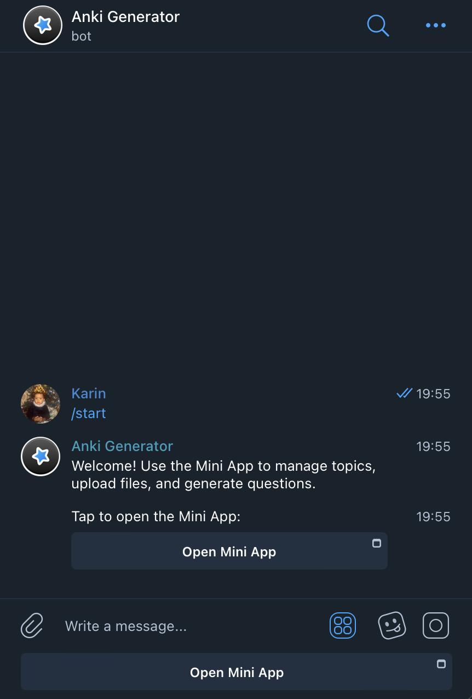
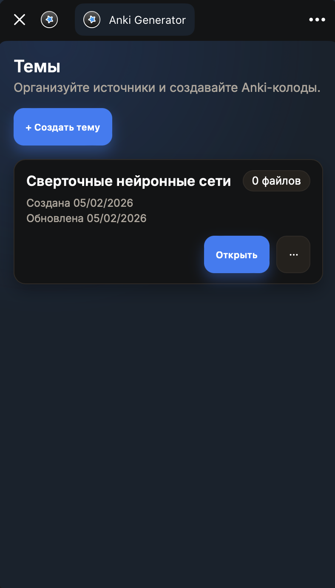
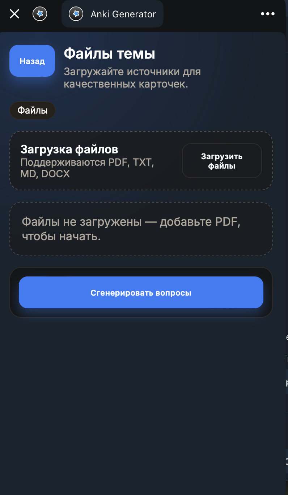
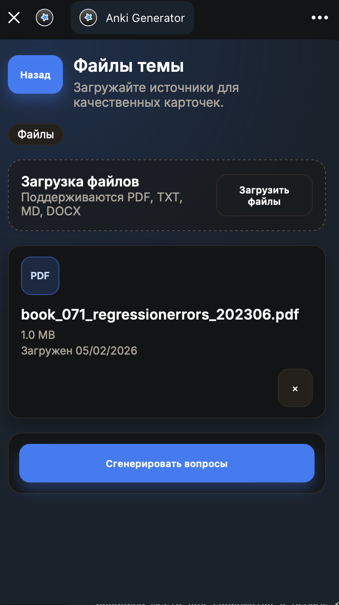
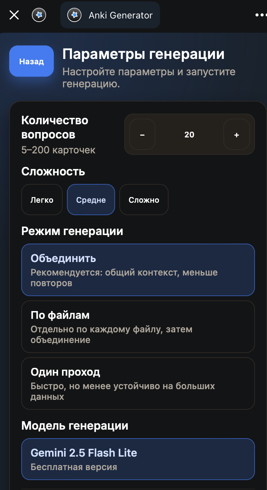
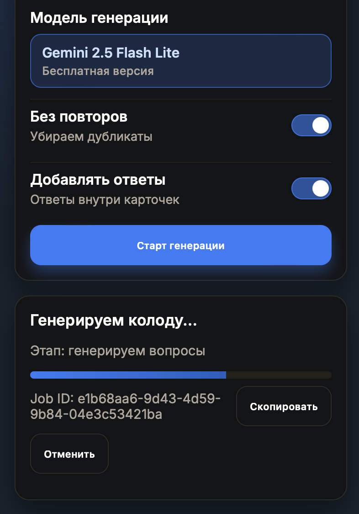

# Telegram Anki

Полноценный бот для генерации Anki‑колод из учебных материалов с помощью Telegram‑бота и Mini App. Проект включает веб‑интерфейс, API, асинхронного воркера, хранение файлов и AI‑пайплайн генерации.

## Основные возможности
- Загрузка PDF/DOCX/TXT и генерация Anki‑колод.
- Асинхронная обработка через Celery + Redis.
- Локальная LLM‑генерация через Ollama (поддержка GPU/Metal на macOS).
- Локальные эмбеддинги и RAG‑retrieval для «привязки» к источнику.
- Дедупликация вопросов и базовая валидация качества.
- Сохранение метрик генерации: latency, throughput, stage timings, dedupe и др.
- Экспорт в `.apkg`, готовый к импорту в Anki.

## Скриншоты

<table>
  <tr>
    <td align="center">
      <br/>
      <sub>Telegram entry</sub>
    </td>
    <td align="center">
      <br/>
      <sub>Topics</sub>
    </td>
    <td align="center">
      <br/>
      <sub>Empty files</sub>
    </td>
  </tr>
  <tr>
    <td align="center">
      <br/>
      <sub>Files with PDF</sub>
    </td>
    <td align="center">
      <br/>
      <sub>Generation params</sub>
    </td>
    <td align="center">
      <br/>
      <sub>Generation progress</sub>
    </td>
  </tr>
</table>

## Архитектура

```
┌──────────────────────────────────────────────────────────────────────────┐
│                             USER / INTERFACE                             │
└──────────────────────────────────────────────────────────────────────────┘
   ┌──────────────┐     ┌────────────────────┐     ┌──────────────────────┐
   │ Telegram Bot │ ──▶ │ Web Mini App (UI)  │ ──▶ │      API (FastAPI)   │
   └──────────────┘     └────────────────────┘     └─────────┬────────────┘
                                                            │
                                                            ▼
                                                 ┌──────────────────────┐
                                                 │   Queue (Redis)      │
                                                 └─────────┬────────────┘
                                                           ▼
┌──────────────────────────────────────────────────────────────────────────┐
│                               WORKER (Celery)                            │
└──────────────────────────────────────────────────────────────────────────┘

  ┌─────────────────┐  ┌───────────────┐  ┌───────────────────┐
  │  Extraction     │→ │   Chunking    │→ │  Normalize Chunks │
  └─────────────────┘  └───────────────┘  └─────────┬─────────┘
                                                    │
                                                    ▼
  ┌───────────────────────────────────────────────────────────────┐
  │                 Index / Retrieval (RAG)                      │
  │  • Vector DB (Chroma + Embeddings)                           │
  │  • Fallback: Lexical retrieval                               │
  └───────────────┬──────────────────────────────────────────────┘
                  │
                  ▼
  ┌───────────────────────┐        ┌───────────────────────────┐
  │ Planner (Topics)      │ ─────▶ │ Evidence Builder          │
  │ LLM: short topic list │        │ top‑k chunks per topic    │
  └──────────┬────────────┘        └──────────────┬────────────┘
             │                                    │
             └────────────────────────────────────┘
                              ▼
                   ┌────────────────────┐
                   │ QGen (LLM)         │
                   │ open / mcq / tf    │
                   └──────────┬─────────┘
                              ▼
                   ┌────────────────────┐
                   │ Verify / Tagging   │
                   │ sources / unverified│
                   └──────────┬─────────┘
                              ▼
                   ┌────────────────────┐
                   │ Mix + Dedupe       │
                   │ simhash + jaccard  │
                   └──────────┬─────────┘
                              ▼
                   ┌────────────────────┐
                   │ Export (.apkg)     │
                   └──────────┬─────────┘
                              ▼
┌──────────────────────────────────────────────────────────────────────────┐
│                                 STORAGE                                  │
│   Encrypted files + Exports                                               │
└──────────────────────────────────────────────────────────────────────────┘

                              ▼
┌──────────────────────────────────────────────────────────────────────────┐
│                            STATUS TO USER                                │
│         Worker → API → Web App → Telegram User                            │
└──────────────────────────────────────────────────────────────────────────┘
```


**Сервисы**
- `bot/` — aiogram‑бот, открывает Mini App и управляет доступом.
- `web/` — React Mini App UI (Telegram WebApp SDK).
- `api/` — FastAPI backend (auth, темы, файлы, запуск задач).
- `worker/` — Celery‑воркер (извлечение, генерация, экспорт).
- `infra/` — Dockerfiles, compose, миграции.
- `data/` / `storage/` — зашифрованное хранение файлов и экспортов.

## AI‑пайплайн генерации (подробнее)

```
┌───────────────┐  ┌───────────────┐  ┌───────────────────┐  ┌─────────────────────┐
│  Extraction   │→ │   Chunking    │→ │  Normalize Chunks │→ │ Index / Retrieval    │
└───────────────┘  └───────────────┘  └───────────────────┘  │ (RAG + fallback)     │
                                                             └──────────┬──────────┘
                                                                        │
                                                                        ▼
┌───────────────────────┐   ┌──────────────────────────┐   ┌──────────────────────┐
│ Planner (Topics)      │→→ │ Evidence Builder         │→→ │ QGen (LLM)            │
│ short topic list      │   │ top‑k chunks per topic   │   │ open / mcq / tf       │
└───────────────────────┘   └──────────────────────────┘   └──────────┬───────────┘
                                                                       ▼
                                                        ┌──────────────────────┐
                                                        │ Verify / Tagging     │
                                                        │ sources / unverified │
                                                        └──────────┬───────────┘
                                                                       ▼
                                                        ┌──────────────────────┐
                                                        │ Mix + Dedupe         │
                                                        │ simhash + jaccard    │
                                                        └──────────┬───────────┘
                                                                       ▼
                                                        ┌──────────────────────┐
                                                        │ Export (.apkg)       │
                                                        └──────────────────────┘
```


Ниже — как устроена генерация и зачем нужен каждый шаг.

### 1) Извлечение текста (Extraction)
**Что делает:** распаковывает входные файлы (PDF/DOCX/TXT) в чистый текст.  
**Почему так:** нормализация входа нужна, чтобы работать с разными форматами одинаково.

### 2) Чанкинг (Chunking)
**Что делает:** режет текст на смысловые куски ~250–450 слов, overlap ~60 слов.  
**Почему так:** LLM лучше работает с небольшими фрагментами; overlap сохраняет контекст на стыках и уменьшает потери смысла.

### 3) Нормализация чанков (Normalize)
**Что делает:** очищает и унифицирует фрагменты (обрезка пустых, нормализация пробелов).  
**Почему так:** уменьшает шум в retrieval и повышает стабильность генерации.

### 4) Индексация и Retrieval (Index / Retrieval)
**Что делает:** строит векторный индекс (Chroma + embeddings); если embeddings недоступны — fallback на лексическое извлечение.  
**Почему так:** retrieval подбирает релевантные фрагменты под каждую тему, снижая «галлюцинации».

### 5) Планирование тем (Plan Topics)
**Что делает:** LLM строит список ключевых тем для каждого файла.  
**Почему так:** обеспечивает равномерное покрытие и снижает повторения.

### 6) Пакеты доказательств (Evidence Packets)
**Что делает:** собирает короткие контекстные блоки для каждой темы.  
**Почему так:** QGen получает только релевантные факты, а не весь документ.

### 7) Генерация вопросов (QGen)
**Что делает:** генерирует open/mcq/tf‑вопросы + ответы + источники.  
**Почему так:** стандартизированный формат облегчает экспорт в Anki и последующую проверку.

### 8) Проверка и теги (Verify)
**Что делает:** отмечает вопросы без источников (например, тегом `unverified`).  
**Почему так:** помогает отсекать «сомнительные» вопросы при финальной сборке.

### 9) Микс и дедупликация (Mix + Dedupe)
**Что делает:** объединяет вопросы с разных файлов и удаляет повторы (simhash + Jaccard по токенам/символьным n‑граммам).  
**Почему так:** экономит место в колоде и повышает разнообразие карточек.

### 10) Экспорт (Export APKG)
**Что делает:** формирует `.apkg` через genanki.  
**Почему так:** Anki‑колода сразу готова к импорту.

## Запуск проекта

### Быстрый старт (Docker)
```bash
cp .env.example .env
# заполнить обязательные секреты:
# BOT_TOKEN, JWT_SECRET, ENCRYPTION_KEY_BASE64

docker compose up --build
```

Сервисы:
- API: http://localhost:8000
- Web: http://localhost:5173

### Полезные команды
```bash
docker compose up --build
docker compose logs -f api worker
```

### Локальная модель (Ollama + Metal на macOS)
```bash
ollama serve
ollama pull qwen2.5:3b-instruct-q4_K_M
```

Проверь значения в `.env`:
- `LLM_PROVIDER=ollama`
- `LOCAL_LLM_MODEL=qwen2.5:3b-instruct-q4_K_M`
- `OLLAMA_BASE_URL=http://host.docker.internal:11434` (для Docker сервисов `api/worker`)
- `OLLAMA_NUM_GPU=-1` (автовыбор; на macOS Ollama использует Metal автоматически)

Если используешь uv локально:
```bash
uv run ruff check .
uv run pytest
```

### Локальный запуск (без Docker)
```bash
uvicorn api.app.main:app --reload
python -m app.main          # bot
celery -A worker.app.celery_app worker -l info
```

## Telegram setup (ngrok + BotFather)
1) Подними локально Web App (порт 5173) и API (порт 8000).
2) Получи HTTPS‑URL через ngrok (или аналог), например `ngrok http 5173`.
3) Пропиши `WEB_BASE_URL` в `.env` равным HTTPS‑URL (домен должен совпадать с Web App).
4) В BotFather:
   - Настрой меню‑кнопку Web App: В настройках бота выбрать Mini App URL и вставить полученное значение, также можно настроить и кнокпку menu: `/setmenubutton` → выбрать бота → URL → название. 
   - (Опционально) Настрой Mini App в профиле бота через `Bot Settings → Configure Mini App`.
5) Перезапусти сервисы и открывай Web App через кнопку в боте.

## Deploy on Dokploy (production)
- Используй файл `docker-compose.dokploy.yml` из корня репозитория.
- Подробная пошаговая инструкция (GitHub app, env, domains, HTTPS для Mini App):
  - `docs/dokploy.md`
- Рекомендуемая схема доменов:
  - `app.example.com` -> web service
  - `api.example.com` -> api service

## Конфигурация
Минимально нужны:
- `BOT_TOKEN` — токен Telegram‑бота
- `JWT_SECRET` — секрет для JWT
- `ENCRYPTION_KEY_BASE64` — 32 байта (AES‑GCM)

Дополнительно:
- `LLM_PROVIDER=ollama` — локальная генерация через Ollama
- `LOCAL_LLM_MODEL=qwen2.5:3b-instruct-q4_K_M` — лёгкая модель по умолчанию
- `OLLAMA_BASE_URL=http://host.docker.internal:11434` — URL Ollama для контейнеров
- `GEMINI_API_KEY` — только если используешь `LLM_PROVIDER=gemini`
- `RAG_USE_EMBEDDINGS=true` включает embeddings
- `EMBEDDING_PROVIDER=local` для локальных эмбеддингов
- `RAG_REUSE_VECTOR_STORE=true` — переиспользовать существующий Chroma-индекс (сильно ускоряет повторные генерации)
- `JOB_EXTRACT_CONCURRENCY=4` — параллелизм извлечения текста
- `JOB_CHUNK_CONCURRENCY=4` — параллелизм chunking

## Метрики и бенчмарк
После нескольких запусков генерации можно собрать агрегированный отчёт:

```bash
uv run python scripts/generation_metrics_report.py --limit 50 \
  --json-out results/metrics-summary.json \
  --md-out results/metrics-summary.md
```

Скрипт считает ключевые метрики для резюме: `p50/p95` по времени, скорость генерации, среднюю LLM latency, число вызовов, dedupe и stage timings.

## Что важно знать
- Файлы хранятся **зашифрованно** (AES‑GCM).
- При проблемах с embeddings включается **лексический fallback**.
- Отмена/перезапуск генерации автоматически завершает старые задачи.

## Структура репозитория
```
api/        FastAPI + SQLAlchemy + Alembic
worker/     Celery pipeline
bot/        Telegram bot (aiogram)
web/        React Mini App (Vite)
infra/      Docker + scripts
data/       runtime data (encrypted files, exports)
```
